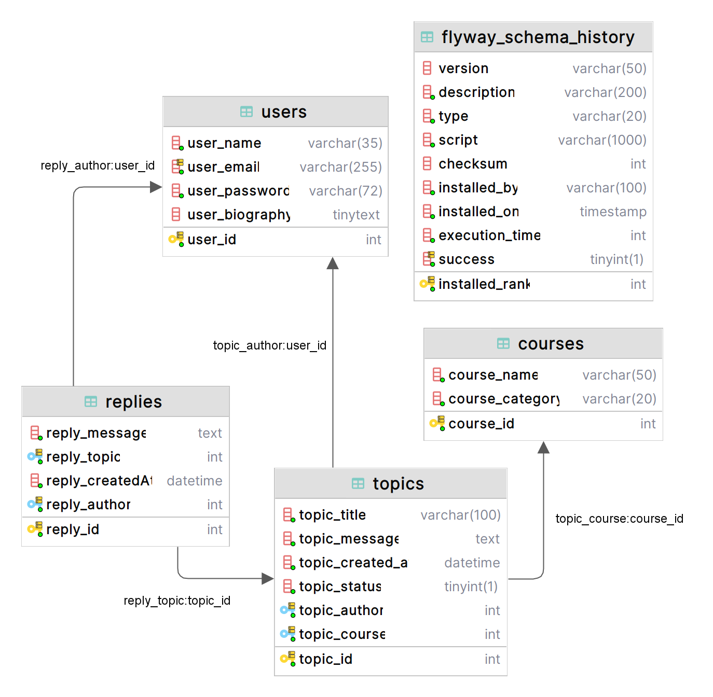

# ForoHub API REST
Challenge de Oracle Next Education para la Formación Java y Spring Boot G6 - ONE.

## ¿Qué es?
ForoHub es una API REST desarrollada en Spring Boot que permite gestionar tópicos de un foro.

Cuenta con autenticación y autorización de usuarios por medio de Spring Security y JWT.

El alcance de este Challenge se centra en los tópicos, siendo obligatoria la implementación de las operaciones CRUD 
(Create, Read, Update and Delete) sobre estos.

Sin embargo se ha ido un poco más allá y se han creado los siguientes endpoints.

- **POST: /auth/signup** para crear un nuevo usuario.
- **POST: /courses** para crear un nuevo curso.

Además el diseño de la base de datos (creada en MySQL) permite que se puede escalar el proyecto para la implementación
de respuestas (replies) a un tópico, por parte de otros usuarios.

## Modelado de datos

## Variable de entorno
Se deben configurar las siguientes variables de entorno para el correcto funcionamiento del proyecto.

| Nombre de variable  | Justificación                                     |
|---------------------|---------------------------------------------------|
| DATASOURCE_SERVER   | Dirección IP del servidor de base de datos        |
| DATASOURCE_PORT     | Puerto de comunicación con la base de datos       |
| DATASOURCE_NAME     | Nombre de la base de datos                        |
| DATASOURCE_USERNAME | Nombre de usuario para acceder a la base de datos |
| DATASOURCE_PASSWORD | Contraseña para acceder a la base de datos        |
| JWT_SECRET_KEY      | Secret Key para firmar JWT válidos                |
| JWT_EXPIRATION_TIME | Tiempo de expiración de los JWT generados         |

## Documentación
La API ha sido documentada usando la especificación OpenAPI (Swagger). 

Una vez ejecutado el proyecto se podrá acceder a la documentación en http://localhost:8080/swagger-ui/index.html.

